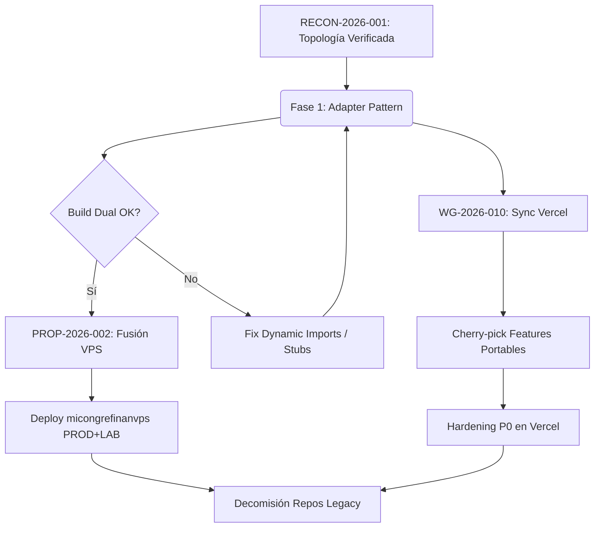

# 🗺️ PLAN MAESTRO — Convergencia y Sincronización MSP

**ID:** PLAN-2026-001
**Creado:** 2026-09-12
**Estado:** 🟡 Aprobado para ejecución
**Integra:** `RECON-2026-001` · `PROP-2026-002` · `WG-2026-010`
**Regla de Oro:** Adapter → Fusión VPS → Sync Vercel (secuencial, no paralelo).

---

## 1. Mapa de dependencias críticas

> ⚠️ Los builds duales (`DB_DRIVER=sqlite|supabase`) son el **gate de salida** de la Fase 1. No iniciar fusión ni sync antes.

---

## 2. Backlog unificado por prioridad

| Prioridad | Item | Origen | Destino | Notas |
| :--- | :--- | :--- | :--- | :--- |
| **P0** | Auth Guard 47 rutas + Rate Limit | WG-2026-010 | Vercel | Middleware Supabase Auth, NO JWT casero |
| **P0** | Scoping `congregation_id` estricto | WG-2026-010 | Vercel | `/api/users` + auto-assign |
| **P0** | Fix Upsert Compuesto + RETURNING | RECON/PROP | PROD | LAB (`24d3e90`) tiene la versión correcta |
| **P1** | OCR Interno Cuentas | RECON/WG | LAB | PROD lo tiene, LAB lo perdió (`52124a6`) |
| **P1** | Auto-Assign Conciliación | PROP/WG | Ambos | Fixtures reales + test unitario |
| **P1** | Suite Print/Reportes Paridad | WG-2026-010 | Vercel | Puro front/lib, sin deps nativas |
| **P2** | Telegram Refactor + Outgoing Speakers | RECON | PROD | LAB adelante |
| **P2** | Territorios iPad + Touch Layer | WG-2026-010 | Vercel | Bajo riesgo |
| **P3** | Programs Sep-2026 + explaining_beliefs | WG-2026-010 | Vercel | Datos puros + UI menor |

---

## 3. Mitigaciones técnicas obligatorias

### 3.1 Build Safety para Vercel
- **Problema:** `better-sqlite3` rompe el build serverless.
- **Solución:** `dynamic import()` en `src/lib/data/sqlite/db.ts` + stub vacío cuando `DB_DRIVER=supabase`.
- **Validación:** Build de Vercel pasa **antes** de cualquier cherry-pick.

### 3.2 SQLite Concurrency en PM2
- **Problema:** cluster mode causa `SQLITE_BUSY`.
- **Solución:** `instances: 1` / `exec_mode: 'fork'` + `PRAGMA busy_timeout = 5000;`.
- **Documentar** en `PROCEDIMIENTO_CONEXION_VPS_Y_PRODUCCION.md`.

### 3.3 Testing de paridad funcional (auto-assign)
- **Solución:** fixtures reales de PROD y LAB + test unitario de salida idéntica.
- **Criterio:** si difieren, investigar causa raíz antes de fusionar.

### 3.4 Health check profundo post-deploy
- **Solución:** `/api/health/deep` → `SELECT 1` + verifica `meetings`, `persons`, `territories`.
- **Uso:** obligatorio en cutover y post-sync.

---

## 4. Runbook de ejecución secuencial

### Fase 0 — Preparación y snapshots (Día 1)
1. Etiquetar heads: `pre-sync/vercel-main` (`54a88bf`), `pre-sync/prod` (`52124a6`), `pre-sync/lab` (`24d3e90`).
2. Backup SQLite PROD y LAB (`/opt/msp/backup.sh`).
3. Congelar deploys automáticos en LAB.
4. Crear rama `sync/vps-improvements` en repo Vercel.

### Fase 1 — Adapter Pattern (Días 2-3)
1. Crear `src/lib/data/index.ts` con `getDataClient()`.
2. Mover `db.ts`/`sqlite.ts` a `src/lib/data/sqlite/`.
3. Dynamic import/stub para Vercel.
4. `src/lib/auth/getSessionContext()` con driver selection.
5. **Gate:** builds duales pasan.

### Fase 2 — Fusión VPS → `micongrefinanvps` (Días 4-5)
1. Runbook PROP-2026-002 (pasos 1-3).
2. Política de resolución de 34 archivos.
3. Tests de paridad de auto-assign.
4. Saneo + build dual.
5. Tags `release/prod/*`, `release/lab/*`.

### Fase 3 — Deploy fusionado VPS (Día 6)
1. Cutover VM211 (PROD) → repo + tag prod.
2. `/api/health/deep` + login + menú.
3. Cutover VM250 (LAB) → mismo repo + tag lab.
4. `/api/health/deep` + login + features LAB-only.
5. Actualizar topología.

### Fase 4 — Sync Vercel (Días 7-10)
1. Cherry-pick P1/P2/P3 → `sync/vps-improvements`.
2. Build Vercel tras cada bloque.
3. Hardening P0.
4. QA multi-tenant / sesiones / print.
5. Merge a `main` + deploy.

### Fase 5 — Decomisión y cierre (Día 11)
1. Archivar `meeting-scheduler-pro-vps` y `micogre`.
2. `congregaciontj` = KB-only.
3. Congelar ramas `vps-selfhosted`.
4. Wargames → RESUELTO.

---

## 5. Criterios de aceptación unificados

| ID | Criterio | Fuente | Validación |
| :--- | :--- | :--- | :--- |
| AC-1 | `micongrefinanvps` con historia convergida | PROP | `git log --graph` limpio |
| AC-2 | Build dual pasa (`DB_DRIVER=sqlite\|supabase`) | PROP+Análisis | CI local/manual |
| AC-3 | VM211 y VM250 mismo commit, distinto perfil | PROP | `/api/health/deep` + `git rev-parse` |
| AC-4 | Vercel endpoints protegidos (401 sin sesión) | WG | Curl sin cookies |
| AC-5 | Multi-tenant isolation en Vercel | WG | Usuario A no ve datos B |
| AC-6 | Print/Reportes Vercel = VPS | WG | Comparación lado a lado |
| AC-7 | Ningún artefacto VPS-only en bundle Vercel | WG+Análisis | Bundle analyzer |
| AC-8 | Auto-assign conciliado pasa paridad | Análisis | Test con fixtures |
| AC-9 | Rollback probado (<10 min Vercel, <2 min VPS) | WG+PROP | Drill documentado |
| AC-10 | Topología y HEADs documentados | Todos | Wiki/MOCs |

---

## 6. Matriz de riesgos residual

| Riesgo | Prob. | Impacto | Mitigación |
| :--- | :--- | :--- | :--- |
| Build Vercel falla por native module | Media | Alto | Dynamic import + stub (Fase 1) |
| Auto-assign divergente tras merge | Alta | Alto | Fixtures + test unitario |
| SQLite corrupción en cutover | Baja | Crítico | Backup + integrity_check + restore |
| Auth Supabase incompatible con JWT | Media | Alto | Adapter auth aislado + QA preview |
| Features re-implementadas con hashes distintos | Alta | Medio | Diff por contenido (RECON) |
| PM2 cluster satura SQLite | Media | Alto | `instances: 1` + busy_timeout |

---

## 7. 🔧 Refinamientos propuestos (revisión técnica v2)

> Estos puntos corrigen riesgos de ejecución detectados al validar el runbook contra el código real.

### 7.1 Orden dentro de la Fase 1: **no mover archivos todavía**
- **Conflicto detectado:** el plan mueve `db.ts` → `src/lib/data/sqlite/db.ts` en Fase 1, pero la Fase 2 debe fusionar el `db.ts` de LAB (`24d3e90`, +73/−30, fix upsert compuesto). Si se mueve primero, el merge de 34 archivos pasa a ser un merge con **renames + conflictos de contenido** (peor).
- **Refinamiento:** en Fase 1 introducir **solo la indirección** `getDataClient()` dejando `db.ts`/`sqlite.ts` en su ruta actual (`src/lib/`). La reubicación física a `src/lib/data/sqlite/` se hace **después** de la fusión (Fase 3), como commit mecánico sin lógica.
- **Beneficio:** la Fase 2 conserva un merge de contenido limpio; el conflicto de `db.ts` se resuelve una sola vez, sin renames.

### 7.2 `better-sqlite3` no se resuelve solo con `dynamic import()`
- Next.js/Turbopack **rastrea imports estáticos**; un `import()` condicional en tiempo de ejecución sigue intentando resolver el paquete en build serverless.
- **Refinamiento:** combinar `serverExternalPackages: ['better-sqlite3']` en `next.config`, `require()` diferido dentro de una función alcanzable **solo** con `DB_DRIVER=sqlite`, y **stub de módulo** (alias de Turbopack/Webpack → `src/lib/data/sqlite/stub.ts`) para el build Supabase. Añadir `better-sqlite3` como `optionalDependency` para que Vercel no lo instale.

### 7.3 Build dual de Vercel necesita envs dummy
- `next build` con `DB_DRIVER=supabase` requiere `NEXT_PUBLIC_SUPABASE_URL/ANON_KEY` o el build puede fallar al evaluar módulos. Usar placeholders en el gate de CI (no apuntan a producción).

### 7.4 Fase 0: pasos 2 y 3 requieren acceso al VPS (autorización explícita)
- Backup SQLite y congelar el cron del LAB se ejecutan por SSH a producción (VM211/VM250). **No automatizar sin confirmación**; dejar como checklist de operador con los comandos del `PROCEDIMIENTO_CONEXION_VPS_Y_PRODUCCION.md`.

### 7.5 Rollback VPS realista
- "Rollback <2 min": conservar el `.next`/standalone anterior + `backups/msp-<fecha>.db` y hacer swap inverso con `pm2 restart`. Añadir `PRAGMA integrity_check` antes de reabrir tráfico.

### 7.6 Fixtures de auto-assign sin tocar producción
- Derivar los fixtures de **copias** de `msp.db` (PROD y LAB) volcadas a `/tmp`, nunca ejecutando el motor contra la base viva.

---

*Plan maestro listo. La ejecución inicia por Fase 0 (operador/VPS) y Fase 1 (código, clone aislado). Ver `WARGAME-SYNC-VERCEL-VPS.md` y `PROPUESTA-FUSION-MICONGREFINANVPS.md` para el detalle.*

---

## 8. 📌 Estado de ejecución (2026-09-12)

**Decisión tomada:** ejecutar **Fusión VPS primero** (Opción C), posponiendo el Adapter (Fase 1). Motivo: las 32 rutas con SQL directo amplían el adapter; fusionar primero evita resolver dos veces los conflictos de `db.ts`.

### Fase 2 — ✅ COMPLETADA
- Repo remoto creado: **`https://github.com/oreyes100/micongrefinanvps`** (privado, branch `main`).
- Merge de linajes: `c569974` (PROD `52124a6` + LAB `24d3e90`; 9 conflictos resueltos; 34 archivos, +1729/−676).
- Saneo: `2aa5bfd` (−198 artefactos de tooling/dumps).
- **Verificado:** `next build` EXIT 0 + `.next/standalone/server.js`; features de ambos linajes presentes (LAB: `outgoing-speakers`, `cuentasTelegram`, fix `db.ts` RETURNING; PROD: `cuentas-v2`, `ocr/internal`, `lib/api.ts`, `proxy.ts`, `health` DB).

### Pendientes de Fase 2
- [ ] Tests de paridad de auto-assign con fixtures reales (requieren copia de `msp.db` de PROD/LAB vía SSH).
- [ ] Build con `DB_DRIVER=supabase` (gate del Adapter).

### Fase 1 — ⏸️ POSPUESTA (decisión Opción C)
El Adapter Pattern se ejecutará **sobre el árbol ya fusionado**. Refinamiento §7.1 vigente: no mover archivos hasta cerrar la fusión.

### Fase 3 — ⏳ PENDIENTE (requiere autorización de acceso a VPS)
Cutover de VM211/VM250 al nuevo repo + perfiles de despliegue.

### Fase 4/5 — ⏳ PENDIENTE
Sync Vercel y decomisión de repos legacy.

> Clon local canónico: `/Users/jorge/No sync/Proyectos/micongrefinanvps` (idéntico a `origin/main`).

---

## 9. 🧩 Auto-Assign durante la fusión — Opción C aplicada (2026-09-12)

**Commit:** `379bccf` (push a `micongrefinanvps@main`).

La fusión reveló que PROD y LAB divergen en el archivo `src/services/auto-assign-service.js` en **solo 2 puntos reales** (no 4):

| Hunk | PROD (VM211) | LAB (VM250) | Resolución |
|---|---|---|---|
| Import / cliente | `createClient()` de supabase-js | `sb()` (shim SQLite) | **LAB** (correcto para VPS) |
| Student Parts | persiste `student_part_type='talk'`, LRA por tipo, pool `is_elder/is_ministerial_servant` | no persiste, LRA única `student_part`, pool `can_be_chairman/can_be_speaker`, detecta "que dira" | **Ambas bajo flag (Opción C)** |
| Comentario / condición assistant | equivalente | equivalente | PROD |

**Implementación:** un solo motor con dos estrategias `assignStudentPartStrict` (PROD, default) y `assignStudentPartLegacy` (LAB), seleccionadas por `AUTO_ASSIGN_DRIVER`. Ambas verificadas **idénticas línea por línea** (normalizado) a sus originales. `next build` OK con `strict` y `legacy`.

**Verificaciones solicitadas:**
1. **Regla mensual (no reusar en el mes):** NO está en ninguno de los linajes. Se introdujo en `f39f8cd` (2026-08-12) y se **eliminó en `d9bc196`** (2026-08-23, correcciones de producción). No hay divergencia que preservar.
2. **JOINs/agregados con `getDb()`:** no aplica — este motor usa `sb()`, no SQL crudo.
3. **Scoping `congregation_id`:** presente en PROD y LAB (fix P0), conservado.
4. **Import directo a `sqlite.ts`:** no existe; el archivo importa `sb()` de `crud.ts`.

### 🔜 Estrategia propuesta para las ~20 rutas SQL crudo portables
Recomendación **híbrida (B pragmática)**, no extender el shim (A) ni duplicar por flag (C):
- Las rutas con `getDb()` crudo quedan **VPS-only** y fuera del build Vercel.
- La paridad con Vercel se logra portando **deltas** sobre las versiones Supabase que Vercel ya tiene (no reescribir desde cero).
- Features nuevas sin equivalente en Vercel (messaging, telegram, territory-assignments, outgoing-speakers) se portan como versiones Supabase-compatibles usando `sb()`.
- Motivo: el shim ya cubre todas las rutas que usan `sb()` (47 archivos); solo las ~20 crudas necesitan trabajo manual, y Vercel ya tiene base para casi todas.

---

## 10. 📜 Contrato Fase 1 ↔ Fase 4 — rutas con SQL crudo (`getDb()`)

Lista canónica de las 32 rutas que saltan la abstracción. Es el contrato: ninguna se mueve al adapter; las portables se resuelven en Fase 4 con deltas sobre su versión Supabase.

### VPS-only (14) — excluidas del runtime Vercel
`api/auth/login` · `api/cuentas/{cierre-mes,codes,config,forms,import,ocr/internal,ocr,saldo-inicial,telegram,transactions}` · `api/health` (diagnóstico DB; Vercel usa el suyo) · `api/migrate-weekend` · `api/permissions/set-password`.
> Además, por depender de FS/SQLite (no de `getDb` directo): `api/backup`, `api/restore`, `api/migrate`, `api/super-admin/replication`, `api/super-admin/system`.

### Portable — delta Supabase en Fase 4 (18)
`api/congregation-roles` · `api/congregation/boundary` · `api/field-service-groups` · `api/field-service-meetings` · `api/me` · `api/meetings` · `api/messages` · `api/messaging-settings` · `api/outgoing-talks` · `api/public-talk-history` · `api/pw-assignments` · `api/super-admin/provision` · `api/telegram-settings` · `api/territories/[id]` · `api/territory-assignments` · `api/territory-assignments/[id]` · `api/territory-notifications/run` · `api/weekend-meetings`

> Regla: si alguien propone "extender el shim porque falta una ruta", esta tabla es la respuesta — no se extiende; se porta el delta o se queda VPS-only.

---

## 11. ✅ Fase 1 (Adapter) — COMPLETADA (rama `feat/adapter-fase1`)

**Commit:** `4099633` (rama publicada; `main` intacto).

| Entregable | Estado |
|---|---|
| `src/lib/data/index.ts` → `getDataClient()` (sqlite \| supabase) | ✅ |
| `src/lib/auth/index.ts` → `getSessionContext()` (jwt \| supabase) | ✅ |
| `crud.ts` `sb()` → `getDataClient()` (sin tocar 47 call sites) | ✅ |
| `serverContext.ts` fachada + `canAccessCuentas` preservado | ✅ |
| `better-sqlite3` carga perezosa (fuera del runtime Vercel) | ✅ |
| `serverExternalPackages: ['better-sqlite3']` | ✅ |
| **Gate:** build `DB_DRIVER=sqlite` | ✅ OK |
| **Gate:** build `DB_DRIVER=supabase` (envs dummy) | ✅ OK |

**Decisiones de diseño:**
- El edge middleware (`proxy.ts`) importa `@/lib/auth`; por eso `auth/index` NO importa la capa de datos (lee `DB_DRIVER` del entorno directamente) y permanece edge-safe.
- `AUTH_DRIVER` explícito gana; si no, se deriva de `DB_DRIVER` (supabase → supabase, sqlite → jwt).
- Las 18 rutas portables crudas aún fallarían en runtime Vercel si se invocan (getDb sin binding): son VPS-only hasta completar su delta Supabase en Fase 4. El build pasa porque el nativo ya no se importa estáticamente.

**Siguiente:** Fase 4 — portar deltas a Vercel por lotes (empezar por las P0: scoping `congregation_id` y auth guard), y/o Fase 3 cutover VPS.

---

## 12. 🚀 Fase 3 — CUTOVER VPS EJECUTADO (2026-09-12)

**Resultado: ambos entornos en `micongrefinanvps@main` (`b553469`), sin incidentes.**

| | VM211 PROD | VM250 LAB |
|---|---|---|
| Dominio | congregaciontj.duckdns.org | micongre.duckdns.org |
| HEAD | `b553469` | `b553469` |
| PM2 | **fork** (era cluster) · :3000 | fork · :3010 |
| `health/deep` | ok · driver sqlite · all_present · 1 ms | ok · driver sqlite · all_present · 1 ms |
| HTTPS `/login` | 200 | 200 |
| auth guard | 401 | 401 |
| Datos | meetings 42 · users 97 · territories 11 | meetings 42 · users 98 · territories 16 |
| Acceso git | deploy key read-only `VM211-prod` | deploy key read-only `VM250-lab` |
| Cron auto-deploy | — | **congelado** (comentado; reactivar tras 24 h de PROD estable) |

**Incidencias resueltas durante el cutover:**
1. `src/lib/data/` quedó fuera del commit: `.gitignore` tenía `data/` (sin anclar), que atrapaba `src/lib/data/`. Build del VPS falló → **fix `b553469`** (`/data/`). El script aborta antes del swap, prod no se tocó.
2. VM250: `standalone/` obsoleto (copia completa del repo) rompía el typecheck; se eliminó. `next start` no lo usa.
3. VM250: `npm install` falló (`ERR_INVALID_ARG_TYPE`); se resolvió con `npm ci`.
4. `/opt/deploy-msp.sh` y `/opt/deploy_update.sh` actualizados a repo/rama nuevos; se añadió copia de `schema.sql` en el swap de PROD (el runtime lo lee de `cwd`).

**Rollback disponible:** tag `release/prod/2026-09-12` / `release/lab/2026-09-12` + backups `msp-2026-09-12.db` (PROD) y `msp-lab-20260912.db` (LAB), integridad OK.

**Pendiente:** 24 h de observación PROD → reactivar cron LAB → Fase 4 (deltas Vercel).

### Checklist post-cutover (2026-09-12T20:48Z)

| Check | VM211 PROD | VM250 LAB |
|---|---|---|
| `SQLITE_BUSY`/locked (2000 líneas) | ✅ 0 | ✅ 0 |
| Errores auth/session/JWT | ✅ 0 | ✅ 0 |
| `health/deep` ×5 | ✅ 0-2 ms | ✅ 0-1 ms |
| `quick_check` SQLite | ✅ ok | ✅ ok |
| Actividad 1 día | 15 reuniones · 106 asign. · 104 tx | 15 reuniones · 107 asign. |
| Errores recientes | ✅ 0 | ⚠️ 6 → **históricos** |

> Hallazgo: la LAB previa (`24d3e90`) no tenía `.lt/.gt` en el shim `db.ts`, por lo que la rotación de `cleaning_group` del auto-assign fallaba (6 errores en el log viejo). `main` (`b553469`, linaje PROD) sí los tiene → **la fusión corrigió un bug latente de LAB**. Verificado: único caller `auto-assign-service.js:610`, cubierto por el shim.

> ⏱️ Solo ~30 min desde el cutover: el checklist es **VERDE** pero no sustituye la ventana de 24 h. No reactivar cron LAB ni iniciar Fase 4 hasta cumplirla.

---

## 13. 🔄 Fase 4 — Sync Vercel (parcial) — 2026-09-14

**Estrategia:** cherry-pick de deltas portables desde `micongrefinanvps` → `meeting-scheduler-pro@main` (Vercel), validado vía Preview + producción con rollback de Vercel.

### P0 — Seguridad ✅ (PR #1, commit en `main`)
- `proxy.ts`: `/api` **default-deny** → 401 salvo `/api/health` y `/api/resolve-login`. Antes `/api` quedaba libre y `GET /api/users` devolvía todas las congregaciones sin sesión (verificado: 200 con datos → ahora 401).
- `auto-assign-service.js`: filtro `users` por `congregation_id`.
- Envs de Preview añadidas (branch-scoped) para que los previews compilen.

### P1 — Programas + motor ✅ (PR #2, `main` `0ff445b`)
- `programs.ts`: Sep-07/14/21 + Oct-26; corrige clave duplicada `2026-09-14`.
- `auto-assign-service.js`: motor corregido en producción VPS (usa `sb()`, que en Vercel es el cliente Supabase service-role).
- Verificado: preview pass, producción Ready, `/api/health` 200, `/api/users` 401, `/login` 200.

### VPS
- Tras **>24 h estables** (checklist ×3 verde), **cron LAB reactivado**.

### Pendiente P1/P2
Suite print/reportes (S-89, publicadores), territorios iPad/WebKit, capa táctil, `explaining_beliefs`, responsabilidades/organigrama, mensajería/Telegram.

### P1b — UI/móvil ✅ (PR #3, `main`)
- `explaining_beliefs`: ambos géneros + ayudante opcional (`MeetingDashboard`).
- Territorios iPad/WebKit: `ResizeObserver`, `tap:false`, flex `100dvh`/`min-h-0` (`TerritoryMap`, `territories/page`). Sin `drawBoundary` (VPS-only).
- Capa táctil iPhone/iPad/Android: `touch.ts` + `layout.tsx` + `IconSidebar.tsx` + `globals.css`.
- Verificado en producción: `/api/health` 200, `/api/users` 401, `/login` 200 y script `touch-device` presente en el HTML.

### Pendiente siguiente
Suite print/reportes (paginación PDF, XLSX/DOCX, S-89, publicadores) — más archivos, impacto alto.

### P1c — Suite print/reportes ✅ (PR #4, `main` `b399205`)
- `exportProgram.ts` (PDF/DOCX/XLSX, paginación, alto contraste), `exportS89.ts` + `s89Individual.ts` (hojas 85 mm), `PrintModal.tsx` (paridad + publicadores), `exportReport.ts`/`printReport.ts`/`ExportMenu.tsx`, `+ xlsx-js-style`.
- Verificado: preview pass, producción Ready, `/api/health` 200, `/api/users` 401, `/login` 200.
- Validación funcional (requiere login): botones de impresión/export, hojas S-89, reporte publicadores.

### Pendiente restante
Responsabilidades/organigrama, mensajería/Telegram (con adapter de datos).

### P1d — Responsabilidades/organigrama ✅ (PR #5, `main` `323ce3c`)
- `responsibilities/page.tsx` (organigrama por categorías) + `congregation-roles` API reescrita sobre Supabase (`sb()`) con `ROLES_CATALOG` y asistentes.
- Verificado: `/api/health` 200, `/api/users` 401, `/api/congregation-roles` 401, `/login` 200.
- Caveat: PK `role_key` en Supabase (no compuesto) → upsert por `role_key`; multi-congregación real requiere migración.

### Pendiente restante
Mensajería/Telegram — Vercel no tiene esas rutas; requiere portar páginas + APIs con la capa de datos Supabase (más trabajo).

### P1e — Mensajería (WhatsApp) + Telegram ✅ (PR #6, `main` `a2aa38c`)
- Libs `messaging.ts`/`telegram.ts` sobre Supabase (async); APIs `/api/messages`, `/api/messaging-settings`, `/api/telegram-settings(/test)` con guard 401; páginas `/messaging` + `/telegram` y módulos adminOnly.
- `territories/[id]`: `notify` best-effort al asignar (inbox + WhatsApp), sin abortar el update.
- **Migración Supabase aplicada** (`20260914000000_messaging.sql`): tablas `messages` + `messaging_settings`.
- Verificado: producción Ready; `/api/health` 200, `/login` 200, las 3 APIs nuevas → 401 sin sesión.

### Nota / pendiente menor
El cron VPS-only `/api/territory-notifications/run` (avisos de **vencido/semanal**) NO se portó: en Vercel solo se generan avisos **al asignar**. Portarlo requiere la ruta (Supabase) + un Vercel Cron. Tampoco se envió Telegram en el flujo de asignación (solo plataforma + WhatsApp), como en VPS.

### P1f — Cron de avisos de territorio ✅ (PR #7, `main` `e67fe34`)
- `/api/territory-notifications/run` sobre Supabase (GET+POST), auth por sesión o `CRON_SECRET`.
- `vercel.json`: Vercel Cron diario `0 15 * * *` (09:00 CST).
- `proxy.ts`: ruta exenta del default-deny (valida el secreto ella misma).
- Verificado: `/api/health` 200, ruta sin auth → 401, `/api/users` 401, `/login` 200.
- `CRON_SECRET` configurado en Vercel (prod + preview branch).
- *Nota:* Telegram no se dispara en el flujo de asignación (igual que en VPS: solo plataforma + WhatsApp).

### Estado Fase 4
Deltas portables P0/P1 completos: seguridad, programas, motor, print/reportes, territorios iPad, capa táctil, responsabilidades, mensajería/Telegram.
